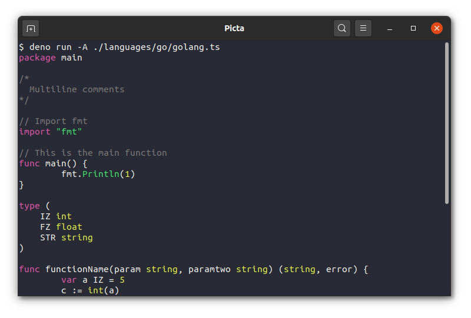

# `picta`

Syntax highlighter for all kinds of shit.

> Work in progress

### Features

* Lightweight, *for real*
* Fast
* Highlight from the terminal or use on the web.
* Supports [Deno](https://deno.land), [Node](https://nodejs.org) & browsers.
* Themes
* Automatic language detection.

